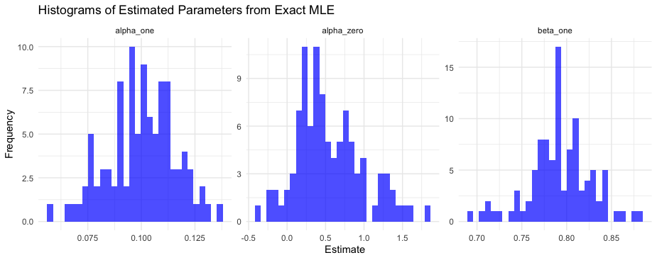

# GARCH-J-model
I conducted this project as part of my studies in Econometrics at the University of Vienna. It implements and analyzes a GARCH-J model using both simulated and real data (log returns of the OMX index).

# Model Overview
The GARCH-J model extends the standard GARCH model by including jumps in returns. This is done by incorporating a jump component that can occur with a certain probability, affecting the overall return and volatility: 

A Monte Carlo approach is used to assess the empirical distribution of estimated parameters, providing insights into the robustness and reliability of the estimation methods.

# Steps

Simulate Data: Generate 1000 data points using specified parameters for jump probability, mean return, and volatility.

Estimate Parameters:
- Quasi Maximum Likelihood Estimation (QMLE): Estimate model parameters using a Gaussian approximation.
- Exact Maximum Likelihood  Estimation (MLE): Estimate model parameters using exact maximum likelihood.
- Monte Carlo Simulation: Perform 100 repetitions to analyze the distribution of estimated parameters.

Fit Real Data: Apply the QMLE method to the real OMX log return data.

# Results

The parameters are chosen as follows: 

λ: 0.5 (Probability of a jump)  
μ: 0.2 (Mean of the GARCH model)  
α₀: 0.4 (GARCH parameter alpha_0)  
α₁: 0.1 (GARCH parameter alpha_1)  
β₁: 0.8 (GARCH parameter beta_1)  
μₖ: -1.5 (Mean of the jump size)  
σ²ₖ: 40 (Variance of the jump size)  

The unconditional mean and variance can now be computed:

σ_uncon: √24.8675 (Unconditional standard deviation)  
μ_uncon: -0.55 (Unconditional mean)  

- **Quasi Maximum Likelihood Estimation (QMLE)**

The Monte Carlo simulation of the parameters estimates the following values using QMLE with a Gaussian approximation:  
α₀: Mean 6.415938  SD 4.799468  
α₁: Mean 0.1085986 SD 0.03470155  
β₁: Mean 0.7496915 SD 0.1224979  

We can see that while the results for α₁ and β₁ are really close to the true values, the estimates for α₀ are far off on average and have a way higher standard deviation.

- **Exact Maximum Likelihood  Estimation (MLE)**

The Monte Carlo simulation of the parameters estimates the following values using MLE (i.e. using the true distribution):  
α₀: Mean = 0.5484885 SD = 0.4350422  
α₁: Mean = 0.1002504 SD = 0.01570205  
β₁: Mean = 0.7919479 SD = 0.0349052  

We can see that accounting for the real distribution naturally gives us more exact mean values with lower standard deviations. The average estimate for Alpha zero is now closer
to the true value as well.

- **Fit Real Data: Apply both QMLE method to the real OMX log return data.**

GARCH models are a tool often  used to model the trajectories of prices on the stock market. A plot of the log returns of the OMX shows a time series with jumps, 
hence we can try to fit our QMLE model to these data points. This gives us the following results:

α₀: Mean = 0.1980424 SD = 0.10462402  
α₁: Mean = 0.1562225 SD = 0.04800268  
β₁: Mean = 0.6868966 SD = 0.12429803
